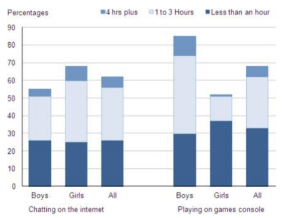

- The chart below shows the amount of time that 10 to 15-year-olds spend
  chatting on the Internet and playing on games [consoles]([[Console]]) on an average
  school day in the UK.
- 
- ## 练习
- id:: 6657e71d-252c-4fcf-b019-8e41fb75734d
-
-
- ## 范文
- 改写段：
- The bar chart compares the time spent by 10 to 15-year-olds in the UK on
  two activities, [[Namely]] chatting online and playing computer games.
- 概述段：
- Overall, we can see that playing computer games is [[Marginally]] more popular
  than chatting on the Internet. However, completely different trends can
  be seen if we look at the specific figures for boys and girls.
- 细节段1：
- Boys aged between 10 and 15 clearly favor playing on games consoles over
  chatting online. According to the chart, while 85% of boys play computer
  games every day, only 55% chat online daily. Furthermore, the majority
  of boys play on their consoles for more than one hour each day, and 10%
  do this activity for four hours or more.
- 细节段2：
- By contrast, girls prefer chatting online. Close to 70% of 10 to
  15-year-old girls [[Engage in]] online conversation each day, compared to
  about 50% of this [[Cohort]] who play computer games. Of the girls who do play
  on consoles, most of them play for less than an hour, [[Whereas]] most girls
  who chat online do so for more than one hour, and nearly 10% chat for four
  hours or more.