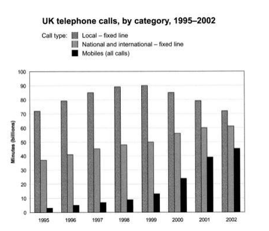

-
- The chart below shows the total number of minutes (in billions) of telephone calls in the UK, divided into three categories, from 1995-2002.
- {:height 434, :width 471}
- ## 解题思路
- Main features:
	- Local > National and international > Mobile
	- Local: increase during 1995-1999, max at 1999, and then decrease.
	- National and international, as well as Mobiles keep growing.
- ## SIMON 范文
- ### 改写段
- 上述图表比较了1995至2002间英国三种通话方式的总通话时长。 #card
	- The bar chart above compares the amount of time spent by people in UK on three different types of phone call between 1995 and 2002.
- ### 概述段
- 概述特征：Local fixed line 的通话时长比 National and international fixed line 以及 Mobiles 的时长都长。
	- It is clear that calls made via local, fixed lines were the most popular type, in terms of overall usage, throughout the period shown.
- 描述特征：Modiles 的时长是最短的，但是其也是增长最快的。
	- The lowest figures on the chart are for mobile calls, but this category also saw the most [[Dramatic]] increase in user minutes.
- ### 细节段
- 描述细节：在 1995 年，Local fixed line 的时长为 70 billion minutes, national and international fixed line 大概是其一半，Mobile 的时长很少，大概只有 4 billion.
	- In 1995, people in the UK used fixed lines for a total of just over 70 billion minutes for local calls, and about half of that amount of time for national and international calls. By [[Contrast]], mobile phones were only used for 4 billions minutes.
- 描述细节：在后续四年中，几种 Phone calls 都稳定增长。
	- Over the following four years, the figures for all three types of phone calls increased [[Steadily]].
- 描述细节：到 1999 年，local fixed line 的达到了顶峰，到达了 90 billion minutes，而后续开始下降。但是其他两种 phone call 继续增长。
	- By 1999, the amount of time spent on local calls using landlines had reached a peek at 90 billion minutes. [[Subsequently]], the figure for this [[Category]] fell, but the rise in the other two types of phone call continued.
- 描述细节：到 2002 年，national and international fixed line calls 超过了 60 billion，而 mobile 的增长至 45 billion.
	- In 2002, the number of minutes of national and international landline calls passed 60 billion, while the figure for mobiles rose to around 45 billion minutes.
-
- [[Band]] 9.
-
- ## 仿写
-
-