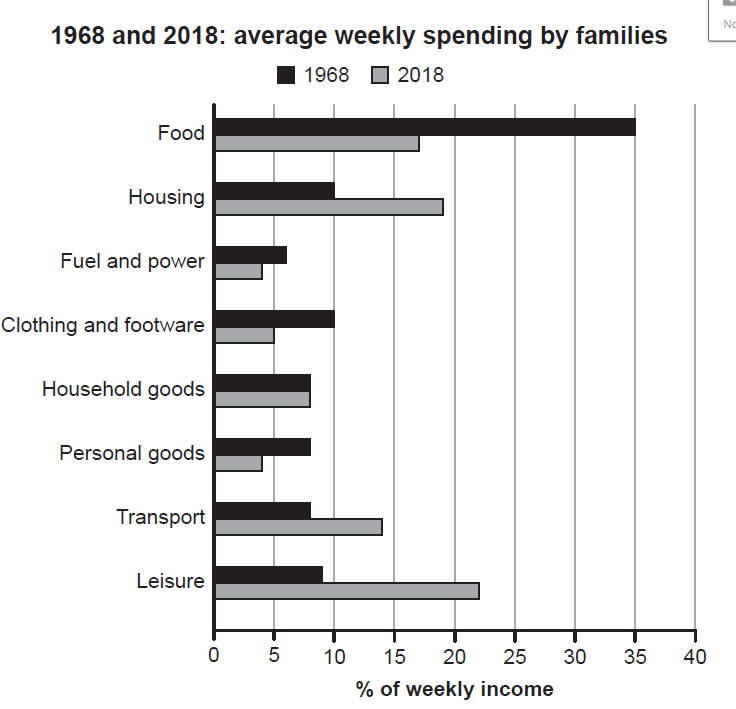

- The chart below gives information about how families in one country spent their weekly income in 1968 and in 2018. Summarise the information by selecting and reporting the main features, and make comparisons where relevant.
- 
-